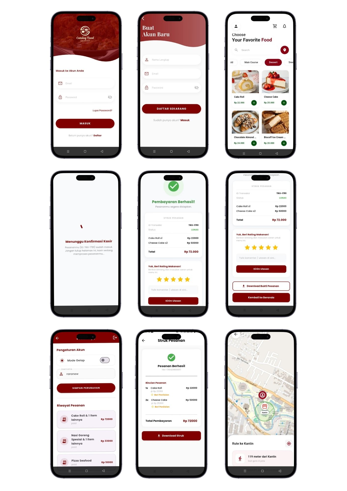

# 🍔 Foodie Catalog (Catalog Food App)

**Foodie Catalog** is an Android-based mobile application developed using the Flutter Framework. This application aims to digitize the food ordering experience in the campus cafeteria with key features including an interactive menu catalog, shopping cart management,Live Location & Navigation, and real-time payment status tracking.

This project was developed to fulfill the Mobile Programming course assignment at the University of Muhammadiyah Malang.

## 📸 App Preview

### 📱 User Interface (Customer)

  

### 💻 Admin Interface (Cashier / Manager)

  

---

## 🎯 Background & Objectives
This application was developed to solve the inefficiencies of the manual ordering process, which often leads to long queues in the cafeteria, and the difficulty customers face in calculating their estimated total price 

---

## 👥 User Roles
This application supports functional separation based on access rights:
**User Role (Customer):** 
1. Has access to create an account
2. Browse the menu catalog
3. Manage the shopping cart
4. Track location on the map
5. Proceed to checkout/payment.
**Admin Role (Cafeteria Manager):**
1. Has special authority to validate incoming order payments by changing the status from `PENDING` to `PAID` within the Admin Dashboard or
   Supabase database.
2. Can see reviews and stars given by buyers

---

## ✨ Key Features
1. **User Authentication**
   Login and Register using Email/Password .
3. **Responsive Catalog**
   Displays the menu in a Grid format that adapts to Mobile/Tablet screen sizes.
4. **Cart Management**
   Add items, remove items, and automatically calculate the subtotal.
5. **Payment Process & Receipt**
   Creates an order with a 'PENDING' status and displays payment transfer instructions. Once the payment is validated ('PAID' by Admin in
   the dashboard), it generates an official digital receipt that can be directly downloaded to the device's local storage, complete with
   an integrated rating and review system.
6. **Live Location & Navigation**
   Displays the user's real-time position on an OpenStreetMap and calculates the distance and estimated travel time to the cafeteria.
8. **Profile Management & Dark Mode**
   Allows users to change their name and app theme (Dark/Light), stored in local storage.
10. **Transaction History**
    Allows users to view their past orders, track order statuses, re-download digital receipts, and access the integrated rating and review system.

---

## 🛠️ Architecture & Technologies Used
This application is implemented using the **MVC (Model-View-Controller)** architecture:
1. **View:** UI Pages (`HomePage`, `CartPage`, `ReceiptPage`, `DetailStrukPage`, `ProfileView`, `MapPage`, `AdminDashboardPage`, `NotificationPage`,
   `WaitingConfirmationPage`, `LoginPage`, `SignupPage`).
2. **Controller:** Business Logic (`AuthController`, `ProductController`, `OrderController`, `ProfileController`, `MapController`).
3. **Model:** Data Structure (`ProductModel`, `OrderModel`).
4. **Services:** Global Logic & APIs (`ThemeService`, `FirebaseMessagingHandler`, `NotificationHandler`).

**Technologies & Tools:**
1. **Language & Framework:** Dart (Flutter SDK).
2. **Backend:** Supabase (Auth, PostgreSQL Database, Storage Buckets).
3. **State Management:** GetX for lightweight and fast application performance.
4. **Notifications:** Firebase Cloud Messaging (FCM).
5. **Local Storage:** Shared Preferences.

---

## 👥 Development Team (Group 2 - Class H)
1. **Anggun Ramadhani** (202310370311077)

Informatics Engineering Study Program - Faculty of Engineering
**University of Muhammadiyah Malang (2025)**
